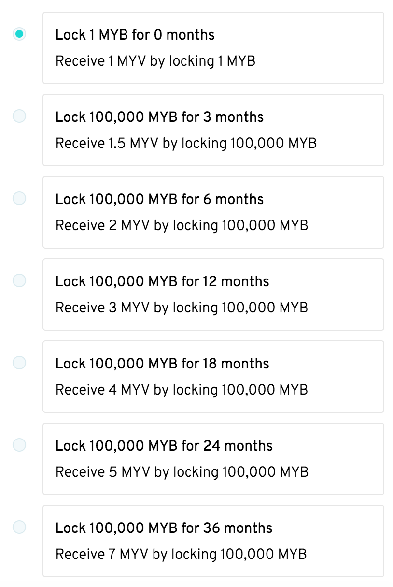

# Test MyBit DAO v0.2

This guide will show you how to test voting with the MyBit DAO through a simple web interface provided by Aragon.

**Overview of voting**

Everyone that has 1 MYB receives 1 vote. If you contributed to [Phase 2 of the MyBit Token Distribution](https://td.mybit.io) you receive 1 extra vote. The number of votes does not increase based on how many MYB you hold. You can however receive a multiplier for locking tokens. The amount required to lock is exactly 100,000 \(less is not allowed, more has no impact on multiplier\). Based on how long you lock for you receive a voting multiplier on your 1 vote which scales linearly.

**There are 3 main steps**

1. Get 100,000 testnet MYB
2. Lock Tokens
3. Vote

**Step 1 - Testnet MYB**

1. First you will need 100,000 Rinkeby testnet MYB. We suggest storing it in metamask. We are developing a faucet for this, in the mean time ping Peter Phillips on t.me/mybit.io to receive the tokens.

**Step 2 - Lock Tokens**

1. Go to the [DAO](https://rinkeby.aragon.org/#/0x13ab94f2cb92A395D8dD73638c74d27Ae397868B/0x8b48d7462d4f2ed97219e40cd9ceefdd9353290f)
2. Go to token Locker on the sidebar, Choose Lock on the top right corner and choose the time period to lock for. 
3. There will be 2 transactions to sign in metamask. By choosing "confirm" on both, your tokens are now locked and you should see your voting token balance \(weight\) in Token Locker next to your ETH address.
4. At any time you can increase the length of time your tokens are locked for and in return receive the associated increase in voting power by following step 2 and choosing a different time period. It is important to note that you can only increase the locked time period, you can never decrease it.

**Step 3 - Propose & Vote**

1. Select the "Voting" tab located on the left side navigation. Here you will be able to initiate a new proposal to be voted on or vote on existing proposals. It is important to note that you can only vote on proposals which were started after the time you locked tokens.
2. To vote on a proposal simply choose "view vote," select yes or no, and sign in metamask.
3. To propose a new vote choose "New Vote" in the top right corner, enter question, select "Begin Vote," then "Create Transaction," then sign in metamask. Wait a few minutes and the proposal should be live for others to vote on.

